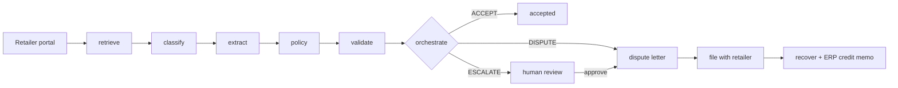

# Clawback

Multi-agent system that recovers cash from invalid retailer deductions for CPG brands. It pulls the support documents for each deduction, checks the claim against the evidence, decides whether to dispute, drafts the dispute with the retailer's own policy cited, and books recovered cash back to the ERP.

Built as an independent portfolio project from the workflow described on Glimpse's public product page (retrieve, validate, dispute, recover). Not affiliated with Glimpse. Retailer policies in this repo are illustrative synthetic text, not real retailer rules, and all data is synthetic.

## The problem

When a retailer short-pays an invoice it takes a deduction: a shortage, a damage claim, a price variance, a late-delivery fine. Many are invalid, but proving it means pulling a proof of delivery (POD), bill of lading (BOL), invoice and purchase order from retailer portals and comparing them, inside a dispute window that can be as short as three weeks. Most brands skip the small ones because the labor costs more than the claim.

## How it works



| Agent | What it does |
|---|---|
| retrieve | Pulls every document for a deduction through a `PortalConnector` and reads PDFs (pypdf, optional Tesseract for scans) |
| classify | Three-stage waterfall: title regex, then keyword scoring, then an LLM for what is left. Content based, file names are ignored |
| extract | Label/value parser that tolerates portal aliases (`Claim Amount`, `Inv No`, `Received On`), with an LLM fill for missing required fields |
| policy | Resolves the retailer's dispute window, deadline and required evidence per reason code |
| validate | Deterministic checks, no LLM: shortage, damage, pricing, delivery window, duplicates, plus invoice footing and amount reconciliation |
| orchestrate | Ordered rule list that returns `DISPUTE`, `ACCEPT` or `ESCALATE` with the rule that fired |
| dispute | Drafts the letter from findings, cites policy sections retrieved with BM25, fact-checks any LLM rewrite against the reference and amount |
| recovery | Records the retailer's outcome and posts an idempotent credit memo to the ERP |

Design choices worth knowing:

- **The LLM is never on the decision path.** Validation and the dispute/accept/escalate call are deterministic and unit tested. The LLM only handles the last classification stage, fills missing fields, and polishes the letter. With `CLAWBACK_LLM_PROVIDER=mock` the whole system runs offline.
- **Fail safe.** Anything inconclusive (missing POD, unsigned POD, documents from different orders, an invoice that does not foot, an amount that does not reconcile, an expired window, an amount above the auto-dispute limit) goes to a human instead of being disputed.
- **Invalid amount is the largest finding, not the sum.** Every check looks at the same claimed dollars, so adding them would double count.
- **Money is integer cents** end to end.
- **Idempotent.** A deduction is unique on (retailer, reference). Reprocessing never duplicates a dispute, a filed dispute is never overwritten, and ERP credit memos are keyed on the deduction.
- **Order-independent duplicate detection.** If the original of a repeat deduction finishes after its twin, the twin is automatically reprocessed.
- **Audit trail.** Every agent writes a timestamped event with its reasoning, shown in the UI.

## Run it

```bash
# backend
cd backend
python -m venv .venv && source .venv/bin/activate
pip install -r requirements.txt
python -m synth.generate --count 120 --noise-rate 0.05   # fake retailer portals with ground-truth labels
uvicorn main:app --reload

# frontend, in a second terminal
cd frontend
npm install && npm run dev
```

Open http://localhost:3000 and click **Sync retailer portals**. Cases stream through the pipeline live over a WebSocket. Open a case to see findings, the evidence, the drafted dispute, and the audit trail. Escalated cases have approve/accept actions. Filed disputes take an outcome that posts to the mock ERP.

To use a real model: copy `.env.example` to `backend/.env`, set `CLAWBACK_LLM_PROVIDER=anthropic` and `CLAWBACK_ANTHROPIC_API_KEY`. Postgres via `docker compose up` is configured but I have not run it.

```bash
cd backend
python -m pytest                                  # 22 tests
python -m evals.run_evals --count 300 --noise 0.10
```

## Evaluation

300 synthetic deductions across 4 retailers and 16 scenarios (invalid and valid shortage, damage, pricing and late-delivery claims, duplicates, missing documents, expired windows, unverifiable promos, high value, unsigned and mismatched documents). Every document is a real PDF read back through the OCR path, and 15% use alternate titles and field labels so the classifier has to fall through to keyword matching. Seed 7, mock LLM.

The clean run is circular: I wrote the generator and the parser, so 100% there only proves the pieces agree. The noisy runs are the informative ones. They corrupt a share of documents the way OCR does (dropped line, dropped digit, swapped digit) and measure whether the system fails safe.

| Share of documents damaged | Decision accuracy | Dispute precision | Dispute recall | Recoverable $ captured | Wrongly disputed $ |
|---|---|---|---|---|---|
| 0% | 100.0% | 100.0% | 100.0% | $84,511 of $84,511 | $0 |
| 10% | 88.7% | 99.2% | 85.5% | $74,859 of $84,708 | $353 (1 case) |
| 25% | 71.4% | 100.0% | 64.8% | $48,722 of $79,159 | $0 |

Accuracy falls with damage because damaged cases move to human review, not because the system starts disputing valid deductions. At 10% damage, 21 disputable cases and 11 valid ones were escalated, which is the cost of fail-safe behavior. The one wrongful dispute at 10% came from a corrupted deduction date that made an expired window look open, which no other document corroborates. The first noisy run also produced a wrongful dispute from a corrupted claimed quantity; the reconciliation checks (invoice footing, amount equals quantity times invoice price) now catch that class. One miss in the other direction remains: a corrupted delivery time made an invalid late-delivery fine look valid, so it was accepted instead of disputed.

Pipeline cost is about 40 ms per case on one thread with the mock LLM. That says nothing about live LLM latency.

## Limitations

- **Portals are mocked.** `FilesystemPortal` stands in for real retailer portal agents. Logging in through MFA and bot detection, scraping, and rate limits are the hard part of the real product and are not built. The `PortalConnector` protocol is where that would plug in.
- **Synthetic data only.** Real documents are messier than a seeded generator, and real deductions include fees and partial reasons that the strict reconciliation check would escalate.
- **LLM paths are implemented but not exercised.** Evals ran with the mock provider. Stage-3 classification (text only, no vision), field fill and letter polish have not been tested against a live key.
- **Single process.** Work runs on an in-process thread pool, not a distributed queue. SQLite by default, Postgres configured but untested here. No auth, no multi-tenancy, no real ERP connector.
- **Policies are illustrative.** Dispute windows and clauses are made up for the demo.

## Layout

```
backend/
  agents/     one module per agent, each a function of (state, deps)
  graph/      LangGraph state and wiring
  core/       llm, ocr, portal connector, policy retrieval, mock ERP, money
  db/         SQLAlchemy models and repository
  jobs/       thread pool runner and duplicate requeue logic
  api/        FastAPI routes and websocket
  policies/   per-retailer policy markdown with front matter
  synth/      synthetic document and label generator
  evals/      harness and scoring
  tests/
frontend/     Next.js dashboard and case detail
```
